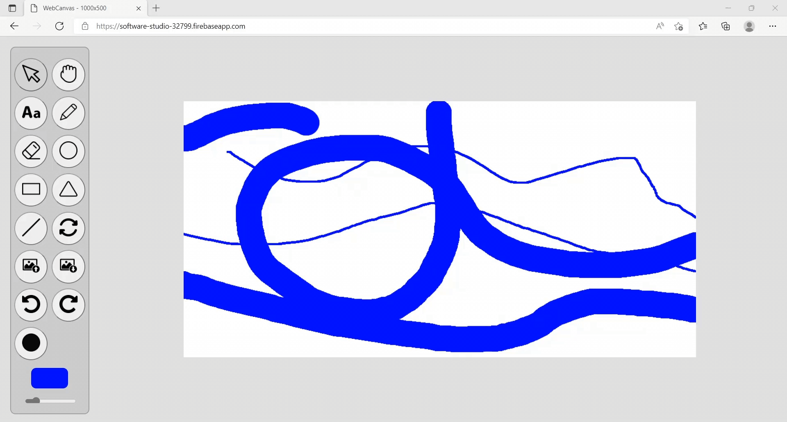

# Software Studio 2022 Spring

## Assignment 01 Web Canvas

### Scoring

| **Basic components**                             | **Score** | **Check** |
| :----------------------------------------------- | :-------: | :-------: |
| Basic control tools                              | 30%       | Y         |
| Text input                                       | 10%       | Y         |
| Cursor icon                                      | 10%       | Y         |
| Refresh button                                   | 5%       | Y         |

| **Advanced tools**                               | **Score** | **Check** |
| :----------------------------------------------- | :-------: | :-------: |
| Different brush shapes                           | 15%       | Y         |
| Un/Re-do button                                  | 10%       | Y         |
| Image tool                                       | 5%        | Y         |
| Download                                         | 5%        | Y         |

| **Other useful widgets**                         | **Score** | **Check** |
| :----------------------------------------------- | :-------: | :-------: |
| Name of widgets                                  | 1~5%     | Y         |

---

### How to use

#### Create a canvas

Create a canvas at first.

  

#### Tool window

You can scroll the tool window with mouse wheel, and change **color**, **size**, **font** at the bottom of tool window.

  

### Basic components

#### Basic control tools

 

#### Text input

 

#### Cursor icon

Besides default cursor, there are four types of cursor.  

 

#### Refresh button

  

### Advanced tools

#### Different brush shapes

 

#### Un/Re-do button

- Can undo/redo 50 steps at most.

 

#### Image tool

After upload a image file, move mouse in canvas and click to confirm the position of image.

 

#### Download

 

### Other useful widgets

#### Customized canvas size

You can create canvas with customized width and height (1~9999px).

 

#### Movable canvas

 

### Firebase page link

&nbsp;&nbsp;&nbsp;&nbsp;[Firebase page](https://software-studio-32799.firebaseapp.com/)